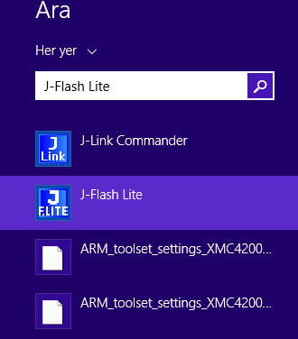
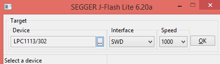
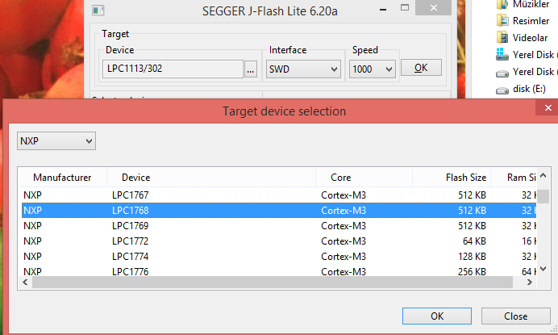
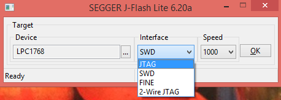
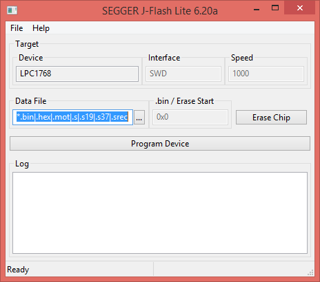
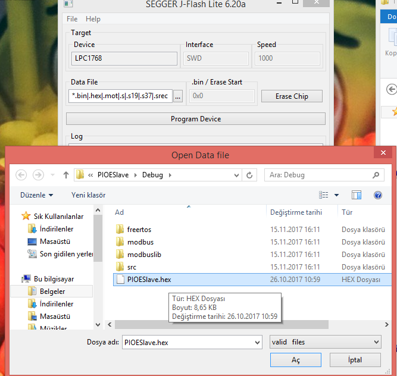
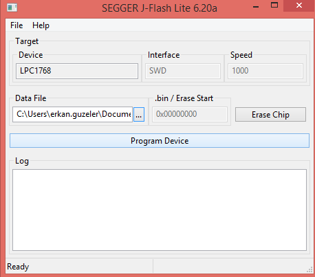

# Hex Dosyasının MCU üzerine yüklenmesi

Burada kullanacağımız program **Jlink** ile beraber gelen **JFlash-Lite** programıdır.

Programı arama sekmesinden arayıp çalıştırıyoruz.

    

Açılan uygulama aşağıdaki gibidir.

    

Buradan işlemcinin marka ve modelini seçiyoruz. 

    

Seçilen işlemcinin ardından hangi **Interface** üzerinden programlanmmasının yapılacağı bilgisi seçiliyor.

    

Seçilen interface den sonra **Ok** butonuna basarak yükleme uygulamasını çalıştırmış oluyoruz. 

    

Yüklemek için **.hex .axf** formatında ki dosyaları seçiyoruz. 

    

Hex dosyamızı da yükledikten sonra **Erase Chip** ya da **Program Device** butonlarına basarak ister chip in hafızasını sileriz istersek hex dosyamızı chip hafızasına kaydederiz.

    

