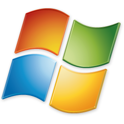

# Why You Should Choice BBQLinux for Android Development.

Hi everyone,

I have developed applications like **Desktop**, *Embedded**, **Android** for 3 years and have heavily developing Android development on [AntriKod Software](www.antrikod.com) for amount 2 years. When I developed Android application, I have used various Operation System like Windows, Ubuntu, Mint and the last one is **BBQLinux**. 

I would like to say something Operation Systems that I used. Firstly, I have used **Windows** Operation System like everyone. But this issiue has not satisfied because it is normally slower when I use **Android Studio** and not a good performance for **Android Development** for me. I always think that alternative ways that I used programs, application, OS to try out. 

    

So first alternative to use Operation System is **Ubuntu** from Linux side. During the first time developing Android in **Ubuntu** is greater than **Windows**. Because working on **Linux** side is exciting to me. I always think that a developer must have information on Linux. Development tools, Open Source are essential issue. Then **Ubuntu** is getting slower when I used it long term. For example, I have working on 4 hours on an application and after 2 hours my **PC** getting warm and getting slower. So that this manner is not good impact for me. 

    

    

