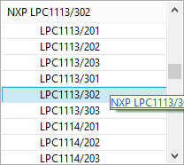
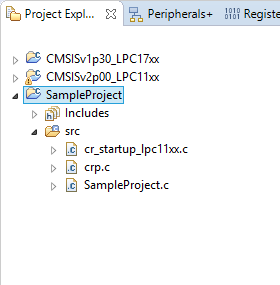
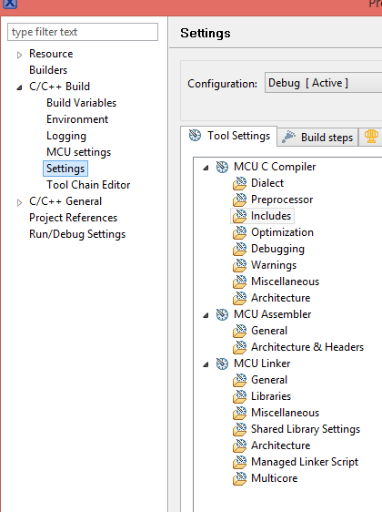
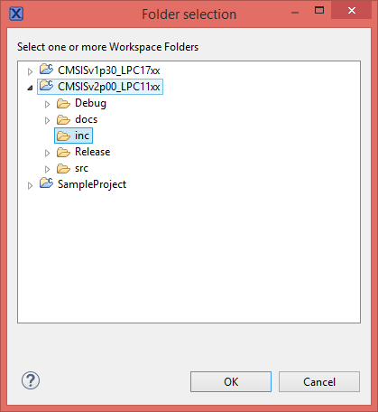
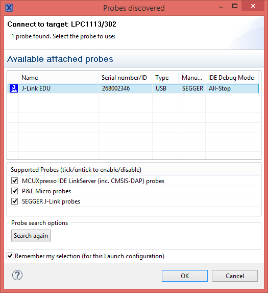
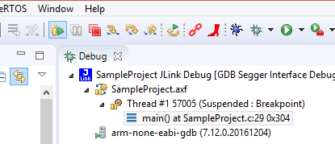

# MCUXPresso Usage

## MCUXpresso

Hi everyone, 

I would like to give you some information about using **MCUXpresso IDE** that builded from **NXP**. This chapter includes about how to **Import** projects to our workspaces, how to builds them, and how to debug and build your projects in workspaces. I will use **LPC1113 and LPC1768** MCU series in my works.

Firstly, you need to install **MCUXpresso IDE** from their official [websites]((https://www.nxp.com/support/developer-resources/run-time-software/mcuxpresso-software-and-tools/mcuxpresso-integrated-development-environment-ide:MCUXpresso-IDE?tab=Design_Tools_Tab)).

### Import Library

I will explain how to include a library into our workspace in our projects. If you use to **LPC** series you need to install **CMSIS Library** to your workspaces. Easily you can download this libraries from my github page for [LPC11xx](https://github.com/coderkan/CMSISv2p00_LPC11xx/tree/master) , [LPC17xx](https://github.com/coderkan/CMSISv1p30_LPC17xx)

After installed these libraries we can open MCUXpresso IDE and go to **Project Explorer** in workspace and right click then you see **Import** section. Below image you can see detail.

    

After clicked **Import** section then you will see under **General** section **Existing Projects into Workspace**. 

    

After **Existing Projects into Workspace** section we can click **Browse** button then demonstrate our library paths. 

    

Go to your library project files path and select it.

    

If you successfully select your library path then you will show imported projects files in **Import** pages. If more than one projects exist in your path you can select which you want. Then click **Finish** button.

    

After added projects to your workspaces then you will see added projects like below images in **Project Explorer**.

    

Import Project steps finished. You can **build** added projects. Right click on project files and click **Build Project**. If you don't have any error in console, build projects has done.

    

### Create Project

This section you will demonstrate how to create new C/C++ project in **MCUXpresso IDE** for **LPC11xx** and **LPC1768**.

Firstly, we need to import **CMSIS Library** our workspaces. After that we can create new **LPC C/C++** embedded projects. 

In **Project Explorer** section right click and select **New**  and **New C/C++ Project**

    

    

Then select which MCU Type you have. I have **LPC1113/302** and **LPC1768**. 

    

Select which language develop your project opened panel. If you select LPCOpen projects before you need to download LPCOpen libraries. I will use **CMSIS Library** so select C project. Then click **Next** button.

    

Type your project name in **Project name:** label then click **Next** button.

    

>Asıl önemli kısım şimdi başlamaktadır. Projeye ekleyeceğimiz **CMSIS Core Library** yi aşağıdaki ekrandan seçiyoruz. Ancak ekrandan seçtiğimiz kütüphanenin **Project Explorer**'a eklenmiş olması gerekmektedir. Bu ekleme işlemini ilk proje kütüphaneleri import ederken yaptığımız için o kütüphane hangisi ise O'nu seçmeliyiz.

    

Seçimimizi yaptıktan sonra karşımıza çıkan ekran dan **None** bölümünü seçerek **Next** tuşuna basabiliriz. Projenin oluşturulma evresi tamamlanmıştır. Oluşan projeyi **Project Explorer**'da görebilirsiniz.

    

Oluşturulan Proje aşağıdaki gibi **Project Explorer**'da görülmektedir.

 
    

Oluşturulan projenin tamamlanmasının ardından **Build** işlemini gerçekleştirebiliriz.

    

Bu adımların sonunda proje oluşturulmuş ve eklediğimiz libraryler **(CMSIS)** projemize eklenmiştir.

### Projeye External Kütüphane Ekleme

>Projeniz için external libraryler geliştirmiş olabilirsiniz. Bunları projenize nasıl ekleyeceğiniz konusunda bilgilendireceğim. Bu adımlar external bir kütüphane eklemek için kullanılır. Yukarıdaki adımlar sizin işinizi görüyor ise bu adımı atlayabilirsiniz.

**Project Explorer** içerisinde ki oluşturduğumuz projemizin üzerine gelip **Properties** sekmesini seçiyoruz ve ardından açılan **C/C++ Build** sekmesinin altındaki **Settings** 

Properties             |  C/C++ Build
:-------------------------:|:-------------------------:
 | 

**Settings** bölümünden seçilen sekmede **Tool Settings** bölümündeki **Include** sekmesine **Include paths (-l)** bölümüne **Add** ile ekleme yapıyoruz. Include dosyalarımızın bulunduğu path bilgilerini ekliyoruz.

    

    

    

    

Ekleme işlemleri bittikten sonra projeyi **Build** edebilirsiniz.

### Projenin Debug Edilmesi

Oluşturulan projenin debug edilebilmesi için **Project Explorer**'da bulunan projemizi seçiyoruz ve ardından **Quick Start** panelinde bulunan **Debug** sekmesine tıklıyoruz ve ardından **Jlink**'in çalışmasını bekliyoruz.

    

İlk çalıştırmamız da JLink ekranı gelecektir seçip devam ediyoruz ve çıkan ekrandan **Accept** butonuna tıklayarak kullanıma hazır ediyoruz.
Programın yüklenebilmesi için devremizin enerjisinin verilmesi gerekmektedir.

    

Debug başarılı olursa **main** fonksiyonun da **breakpoint** e düşecektir. Ardından altta bulunan **Resume All Debug** butonuna basarak projeyi çalıştırabilirsiniz.

    

