# MCUXPresso Kullanımı

## MCUXpresso

Kullandığımız [MCUXpresso IDE](https://www.nxp.com/support/developer-resources/run-time-software/mcuxpresso-software-and-tools/mcuxpresso-integrated-development-environment-ide:MCUXpresso-IDE?tab=Design_Tools_Tab)' sini linkten indirebilirsiniz.

Kurulumu basit, kurduktan sonra JLink de içerisinde gelmektedir. Aksi durumla karşılaşırsanız [JLink](https://www.segger.com/downloads/jlink/) linkinden indirip kurabilirsiniz.

### Proje oluşturulması

#### Proje Import Edilmesi

* İlk olarak projemiz de kullanacağımız nxp kütüphanelerini import edeceğiz. Yeni projelere bunları ekleyeceğimiz için workspace'imiz de bulunmalı.

    **LPC1768** için **CMSISv1p30_LPC17xx**

    **LPC11xx** için **CMSISv2p00_LPC11xx**

kullanıyoruz. İsterseniz bunları değiştirebilirsiniz.

Öncelikle yukarıda belirttiğimiz 2 projeyi de çalıştığımız **workspace** klasörü içerisine atıyoruz. 
Ardından bu projeleri import ediyoruz.

**Project Exploer** sekmesinin bulunduğu yerde sağ click yapıp açılan pencereden **Import** sekmesini seçiyoruz.

    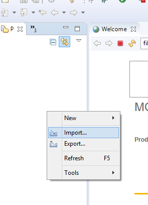

**Import** sekmesini seçtikten sonra karşımıza çıkan ekrandan **Existing Projects into Workspace** sekmesini seçiyoruz.

    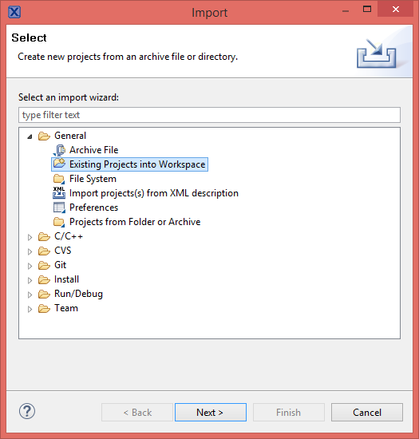

**Existing Projects into Workspace** sekmesini seçtikten sonra karşımıza çıkan ekrandan **Select root directory** labelinde **Browse** kısımından projenin olduğu klasörü seçiyoruz.

    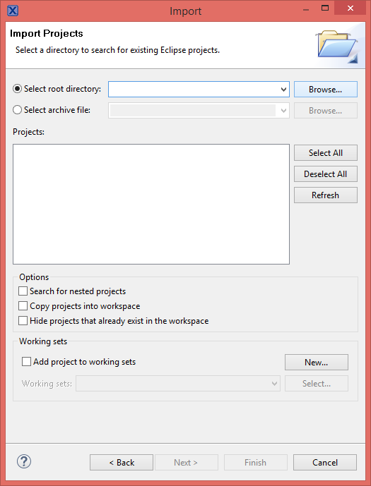

Projeyi aşağıdaki çıkan ekrandan seçebiliriz.

    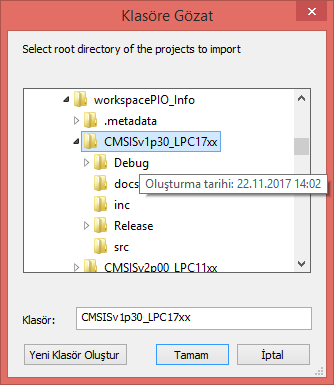

Proje formatına uygun eklenebilecek bir proje var ise gösterdiğiniz yol da aşağıda ki resimden de anlaşılacağı gibi projenin seçilmiş halini gösterir. Birden fazla proje de olabilir ama siz istediğinizi seçerek projeyi ekleyebilirsiniz. Seçimimizi yaptıktan sonra **Finish** butonuna basarak devam ediyoruz.

    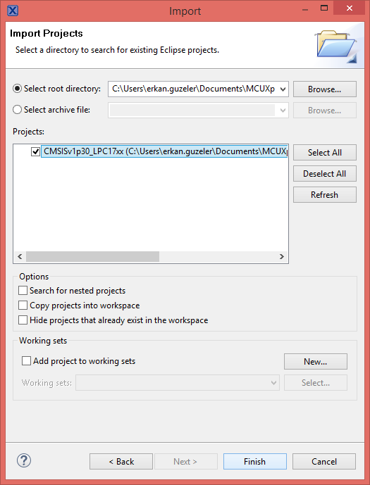

Bu işlemlerin ardından projelerimizi **Project Explorer** üzerinde eklenmiş halini görebiliriz.

    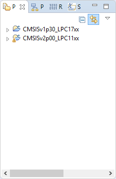

Bu işlemleri yaptıktan sonra eklenmiş projeyi **Build** edebiliriz. Aşağıdaki gibi projenin üzerinde sağa tıklayarak rahatlıkla *Build** alabiiriz.

    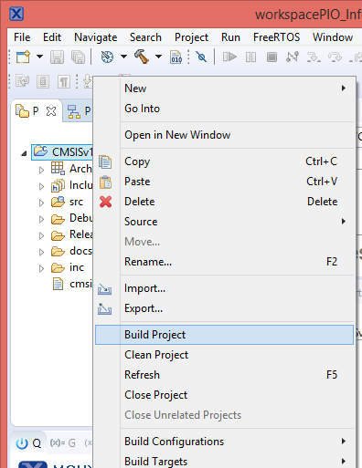

### Yeni Proje Oluşturma

Yeni proje oluşturmak için izlenen adımlar aşağıda sıralanmıştır.

Kütüphanelerimizi ekledikten sonra **Project Explorer** panelinde sağa tıklayarak açılan pencereden **New** sekmesini seçiyoruz ve ardından **Project** sekmesini seçiyoruz.

    

Açılan sekmeden **New C/C++ Project** sekmesini seçiyoruz.

    

İşlemci tipini ve model numarasına göre seçimimizi yapıyoruz.

    

 Açılan pencereden hangi dilde geliştirme yapmak istiyorsak seçimimizi yapıyoruz ve **Next** butonuna basıyoruz.

    

Yeni Projemize ismini veriyoruz ve **Next** butonuna tıklıyoruz.

    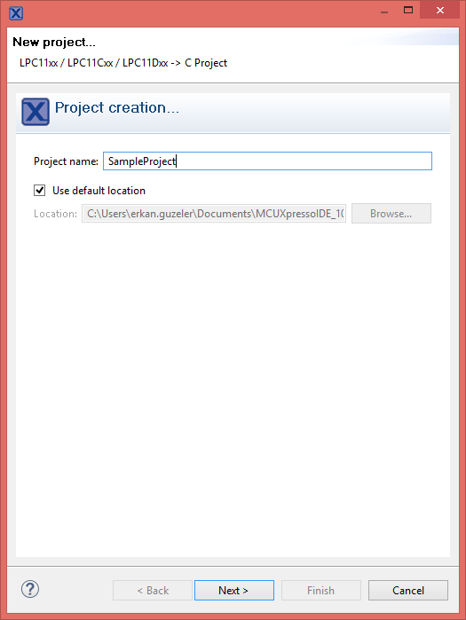

>Asıl önemli kısım şimdi başlamaktadır. Projeye ekleyeceğimiz **CMSIS Core Library** yi aşağıdaki ekrandan seçiyoruz. Ancak ekrandan seçtiğimiz kütüphanenin **Project Explorer**'a eklenmiş olması gerekmektedir. Bu ekleme işlemini ilk proje kütüphaneleri import ederken yaptığımız için o kütüphane hangisi ise O'nu seçmeliyiz.

    

Seçimimizi yaptıktan sonra karşımıza çıkan ekran dan **None** bölümünü seçerek **Next** tuşuna basabiliriz. Projenin oluşturulma evresi tamamlanmıştır. Oluşan projeyi **Project Explorer**'da görebilirsiniz.

    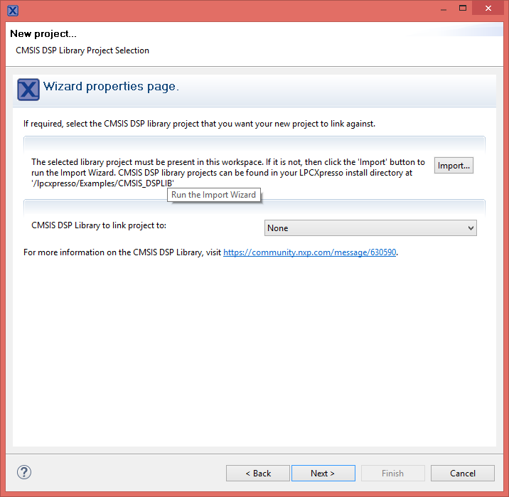

Oluşturulan Proje aşağıdaki gibi **Project Explorer**'da görülmektedir.

 
    

Oluşturulan projenin tamamlanmasının ardından **Build** işlemini gerçekleştirebiliriz.

    

Bu adımların sonunda proje oluşturulmuş ve eklediğimiz libraryler **(CMSIS)** projemize eklenmiştir.

### Projeye External Kütüphane Ekleme

>Projeniz için external libraryler geliştirmiş olabilirsiniz. Bunları projenize nasıl ekleyeceğiniz konusunda bilgilendireceğim. Bu adımlar external bir kütüphane eklemek için kullanılır. Yukarıdaki adımlar sizin işinizi görüyor ise bu adımı atlayabilirsiniz.

**Project Explorer** içerisinde ki oluşturduğumuz projemizin üzerine gelip **Properties** sekmesini seçiyoruz ve ardından açılan **C/C++ Build** sekmesinin altındaki **Settings** 

Properties             |  C/C++ Build
:-------------------------:|:-------------------------:
 | 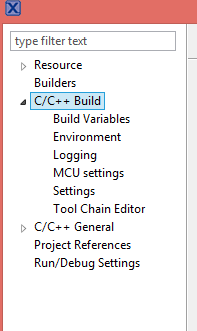

**Settings** bölümünden seçilen sekmede **Tool Settings** bölümündeki **Include** sekmesine **Include paths (-l)** bölümüne **Add** ile ekleme yapıyoruz. Include dosyalarımızın bulunduğu path bilgilerini ekliyoruz.

    

    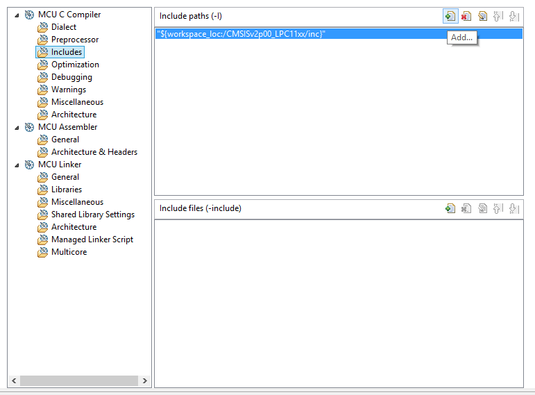

    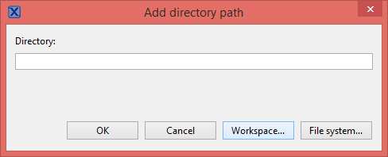

    

Ekleme işlemleri bittikten sonra projeyi **Build** edebilirsiniz.

### Projenin Debug Edilmesi

Oluşturulan projenin debug edilebilmesi için **Project Explorer**'da bulunan projemizi seçiyoruz ve ardından **Quick Start** panelinde bulunan **Debug** sekmesine tıklıyoruz ve ardından **Jlink**'in çalışmasını bekliyoruz.

    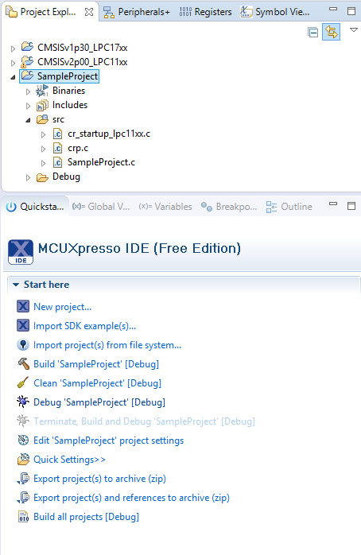

İlk çalıştırmamız da JLink ekranı gelecektir seçip devam ediyoruz ve çıkan ekrandan **Accept** butonuna tıklayarak kullanıma hazır ediyoruz.
Programın yüklenebilmesi için devremizin enerjisinin verilmesi gerekmektedir.

    

Debug başarılı olursa **main** fonksiyonun da **breakpoint** e düşecektir. Ardından altta bulunan **Resume All Debug** butonuna basarak projeyi çalıştırabilirsiniz.

    

